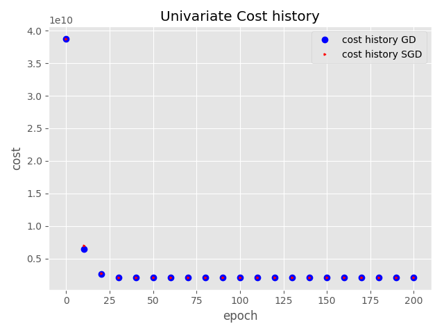
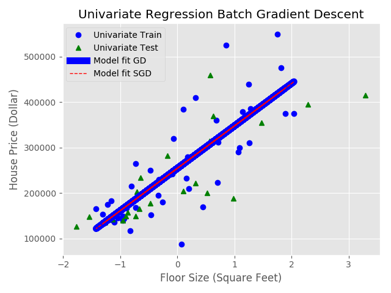

Univariate Linear Regression
=============================

In this question we fit batch gradient descent (BGD)  method to find the
house prices of given univariate data.

a) The plot of J(w) versus the number of epochs with step size 10 is shown
below:

b) After training I printed the parameters (w) for train data and compared
with normal equations. I found that both are exact (for 200 epochs of BGD)::

  Train Data
  epochs  learning_rate  mean        std       w0          w1          rmse        cost
  200     0.1            2340.46     808.44    254,450.00  93,308.92   64,083.51   2,053,348,364.32

c) I plotted the training using the default blue circles and test using green
triangles and also overplot the BGD fitted line.

d) Comparison of BGD and SGD.

In stochastic grad desc, I shuffled the data while training. To get the
reproducible results, I set the random seed to 100. The SGD training gives
noisy results. The weight vector does not stabilize smoothly, it first decreases
rapidly then fluctuates with some noise but after some iterations it will give
similar results like BGD.

For this example after 175 epochs I got similar weight vectors from bgd and sgd::

  np.random.seed(100)
  w_norm_eqn        = [[254,450.0000  93,308.9201 ]]
  iters = 200 w_BGD = [[254,449.9998  93,308.9200 ]]
  iters = 199 w_SGD = [[254,494.4429  93,244.2965 ]]
  abs_diff_min = 109.06649000954349
  np.argmin(abs_diff_min) =  175

e) Extra credit

I also created a gif file that shows beautifully how the best fit line changes
with the number of iterations. The cost function for test data settles down
around 70 itrations. I created 70 png files and combined them to make a gif file.

The file is placed at Extra/cost_history.gif

The imagemagick command to create gif is::

  convert -loop 0 -delay 100 test_images/test*.png cost_history.gif
