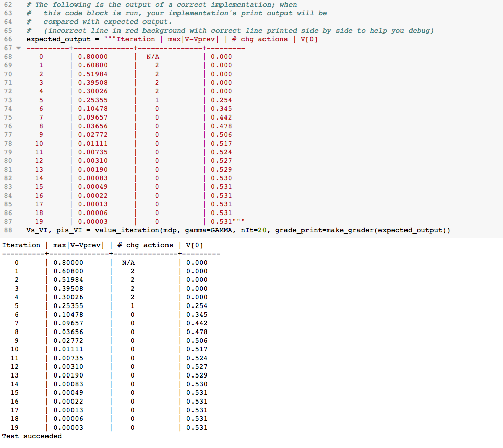
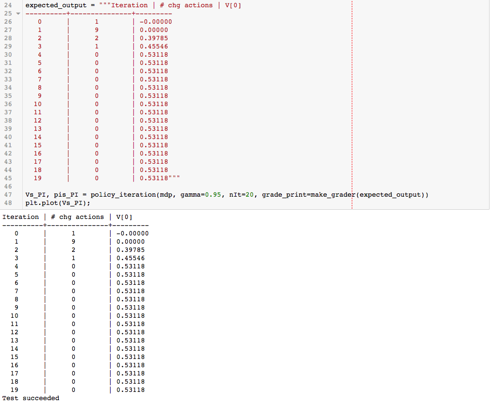
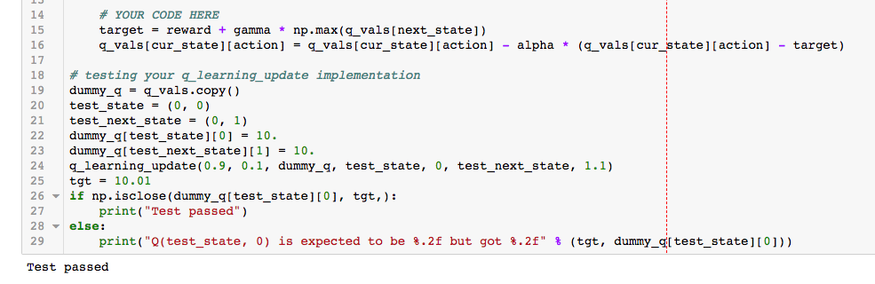
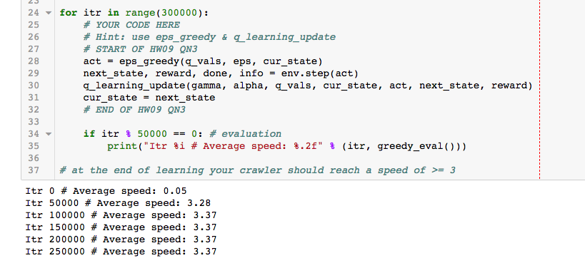

<!-- #================================================* -->
<!-- # Header:   Homework 9 (Reinforcement Learning)   -->
<!-- #================================================* -->
# Hw 9 Report (Bhishan Poudel)

## Set up conda environment

```bash
cd to the downloaded homework 9
sudo -H conda env create -f environment.yml
source activate deeprlbootcamp
jupyter-notebook lab1.ipynb # I have renamed first problem as lab1.ipynb
```

## QN1: Complete value_iteration
Most of the codes was already given.
I just have to find Bellman backup V and policy $\pi$.

I completed the task and the result looks like the expected result.



## Qn2: Policy Iteration

### state value function $V^{\pi}$
Here we calculated the state value function $V^{\pi}$

$$V^{\pi}(s) = \sum_{s'} P(s,\pi(s),s')[ R(s,\pi(s),s') + \gamma V^{\pi}(s')]$$

### state-action value function $Q^{\pi}$
Here we calculated the state-action value function

$$Q^{\pi}(s, a) = \sum_{s'} P(s,a,s')[ R(s,a,s') + \gamma V^{\pi}(s')]$$

### policy iteration
Here, we did the policy iteration and compared the result we got with with
the expected result given the homework 	question. I got the same values and the
test passed.



## Qn3 Q-Learning
I have edited the three functions accordingly so that they work.
The outputs are included here.



