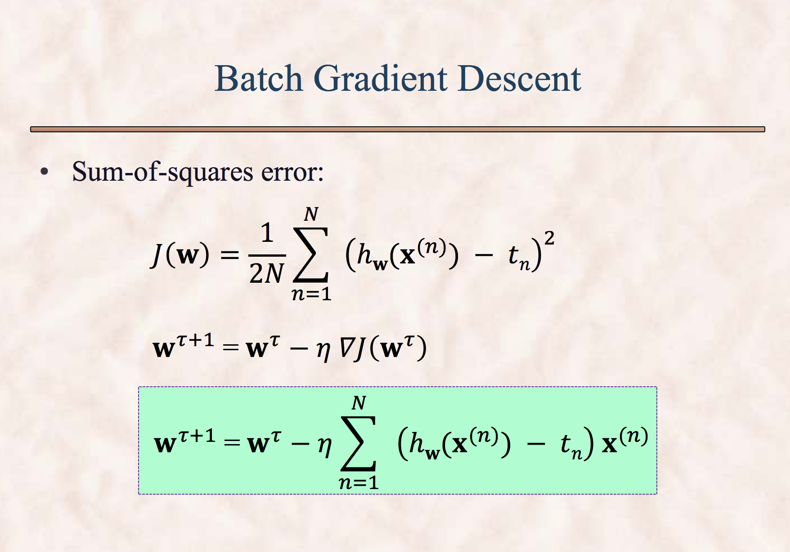
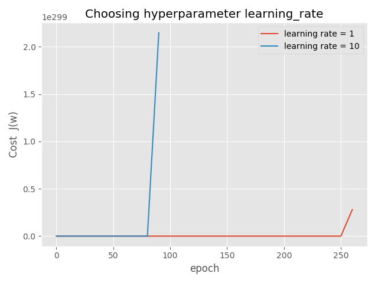

Polynomial Regression
=============================
In this question we fit the polynomial regression with and
without L2 regularization (Ridge Regression) using gradient descent method.

a) The input data is noisy sinusoidal curve generated using
the formula

.. math:: t(x) = sin(2 \pi x) + x (x + 1) / 4 + \epsilon

Where epsilon varies from 0 to 0.005 with Gaussian mean zero and variance 0.005.

The output textfile dataset.txt has 30 examples. It is randomly divided into
three equal parts into the files train.txt, test.txt and devel.txt.

b) I saved and plotted three data sets separately inside the folder images.
hw02qn4_train.png, hw02qn4_test.png, and hw02qn4_devel.png.

For the simplicity I also created a single plot showing all these subplots in a
single plot (images/hw02qn4b.png).

c) The ridge regularized objective function is given below.

.. math::

  J(w) = \frac{1}{2N} \sum_{n=1}^N (h(x_n,w) - t_n)^2 + \
  \frac{\lambda}{2} ||w||^2

The algorithm to minimize the cost function J(w) using gradient descent method is:

.. math:: w^{\tau + 1} = w^{\tau} - \eta \nabla J

Here tau is iteration number and eta is the learning rate.
The gradient of cost function for regularized case is given below.

.. math:: \nabla J = \frac{1}{N} \sum_{n=1}^N (h - t) X + \lambda w

From class lectures I included the formulas to calulate BGD and SGD.

d) In this problem of polynomial curve fitting I chose the degree of the polynomial
to be 5 (that gave the lowest RMSE in previous homework).

d1i) I used the six different learning rates to chose the best learning rate
hyperparameter from training data. The plot of J(w) versus epochs is given below.

From the figure I chose 0.1 to be the smooth and high enough learning rate for
this problem.

d1 ii) I selected the learning rate to be 0.1 and ran the gradient descent as
long as J(w) decreases by at least 0.001 after each epoch.

For different stepsizes I got different final epoch to get the converged value.
The plot is given below:

d1 iii) Here we compare the parameter vector w from normal equation, gradient
descent, and stochastic gradient descent methods::

  # NOTE: I used threshold = 0.001 not 1e-10 for Unregularized cases (bgd and sgd)
  np.random.seed(100) # for SGD to get same results
  shrinkage = 0.00 final_iter = 238 learning_rate = 0.10 deg = 5 threshold = 1.00e-04
  w_norm_eqn  = [[0.1711  1.6086  5.8353  -35.1236  43.5586  -16.1171 ]]
  w_unreg_bgd = [[0.1711  -0.0314  -0.6621  -0.3889  0.1045  0.5930 ]]
  w_unreg_sgd = [[0.1747  -0.0231  -0.6722  -0.3940  0.1107  0.6114 ]]

d2) With regularization.
With threshold of 1e-10 I calculated the cost history for regularized case.
The regularization parameter (shrinkage) value was chosen to be 0.1.

d2 iii) For regulrized case comparison of normal, bgd and sgd is given below::
For regularized case with threshold of 1e-10, at final iteration 657 the cost
function values converges.::

  np.random.seed(100) # for SGD to get same results
  shrinkage  = 0.10 final_iter = 657 learning_rate = 0.10 deg = 5 threshold = 1.00e-10
  w_norm_eqn = [[0.1711  -0.1535  -0.3607  -0.1988  0.0442  0.2763 ]]
  w_reg_bgd  = [[0.1555  -0.1537  -0.3606  -0.1987  0.0442  0.2762 ]]
  w_reg_sgd  = [[0.0890  -0.1079  -0.1054  -0.0680  -0.0268  0.0098 ]]
