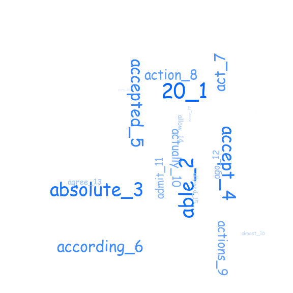

ExtraWork : Plot 20 newsgroups text and SVM model for iris data
=====================================================================================
I did following two tasks for the extra work.

  - plot the text with text size vary according to frequency of the text
	- fit the svm model to famous iris dataset.

Qn1: Plot 20 newsgroups text with text size vary according to text frequency 
--------------------------------------------------------------------------------
Here, I plotted the vocabulary text file for 20 newsgroups classification.

Qn1: SVM for iris data 
--------------------------------------------------------------------------------
Here, I used the linear kernel svm for the iris data. I got 97% accuracy.
The confusion matrix is given below ::
  
  cm = 
  [[13  0  0]
   [ 0 15  1]
   [ 0  0  9]]
  accuracy = 0.9736842105263158
